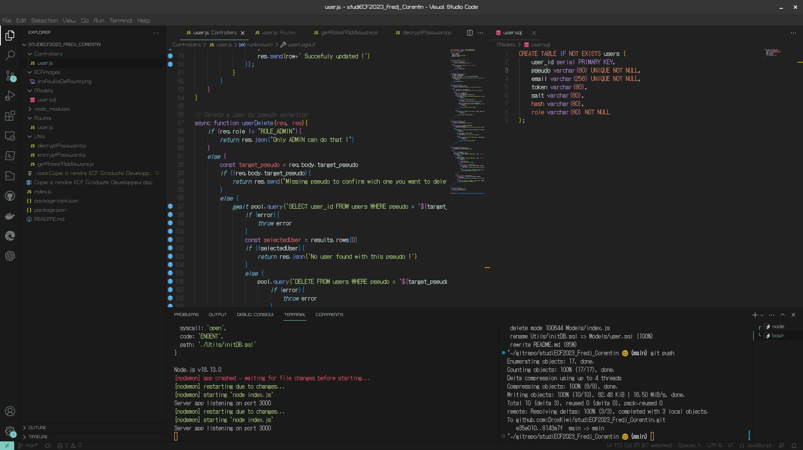
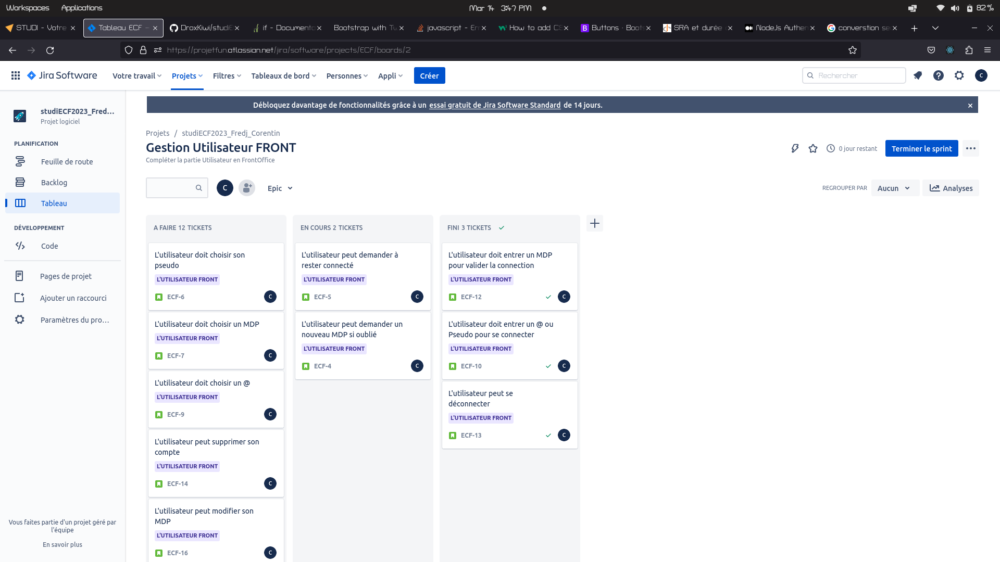
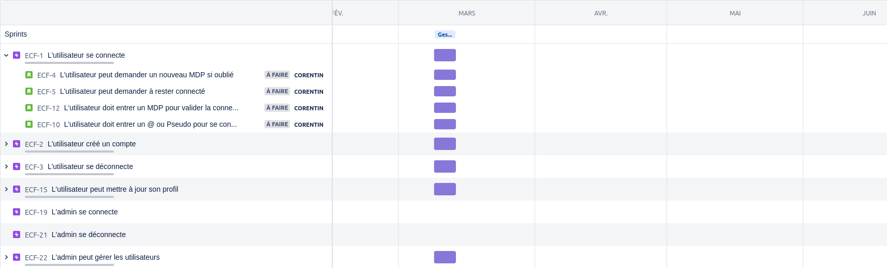

# studiECF2023_Fredj_Corentin

Ceci est le dépôt pour l'ECF Graduate Developper

# Présentation 

Ceci est un projet Web, il a pour but de créer une page de souscription aux notes de patch de mise à jour d'une application en cours de développement (BeWave). L'application en question est un projet sur lequel je travail avec une équipe depuis Août 2021. Pour des raisons de droits je suis dans l'incapacité de vous livrer plus d'informations. 

Sur l'application Web lié à ce projet il sera donc possible de s'inscrire pour obtenir les notes de mises à jour, mais aussi de s'inscrire comme bêta testeur de l'application et obtenir cette dernière en accès anticipé.

L'application BeWave possède aussi un BackOffice et un Front office. Je travail donc depuis un moment déjà sur le framework Symfony. Pour cette raison j'ai décidé de faire celui ci à l'aide d'Express pour découvrir un nouveau framework.

# Outils

- VScode

Une capture d'écran de mon espace de travail : 

J'ai deux écrans, l'un me sert à afficher Postman et la documentation, le second me sert à afficher VScode.

J'ai deux fenêtrage de code, souvent celui de droite est le code sur le quel je me base, typiquement mes modèles et celui de gauche le code que je travails.

J'ai deux invite de commandes, l'un me sert à afficher le prompt et le retour d'erreur du serveur Express et le second à installer mes paquet et naviguer sur ma machine.

Les extensions installées sur VScode sont nombreuses, je ne vais citer que les plus pertinantes pour ce projet. 

- Github - Pour pouvoir effectuer mes commits, changement de branche et fusion de manière assisté et éviter les erreurs
- PowerShell et SSH FS qui me permettent d'obtenir un prompt connecté en SSH à une machine distante
-  Microsoft Edge Tool pour obtenir une fenêtre de navigateur dans VScode, peut être très utile lorsque je souhaite de la documentation et que mon second écran est utilisé.
- ChatGPT, qui me sert EXCLUSIVEMENT et j'insiste, à vérifier des connaissances ou me donner des noms de librairies lorsque je ne connais pas bien le framework.

- [Jira](https://projetfun.atlassian.net/jira/software/projects/ECF/boards/2/roadmap?shared=&atlOrigin=eyJpIjoiMjI5NWYzZmVkMDQ5NDQyMTg2YThmNzViZmRiNTIxNTEiLCJwIjoiaiJ9)

- [Github](https://github.com/DroxKiwi/studiECF2023_Fredj_Corentin)
 

# BackOffice

## Paquets installés

### nodemon

nodemon permet de redémarrer le serveur à chaque modification du code de manière automatique.

### express

Express.js est le framework standard pour le développement de serveur basés sur Node.js

### cookieparser

CookieParser me permet de gérer les cookies comme le token d'itentification

### pg (postgresql)

pg est le paquet permettant de faire communiquer avec plus de simplicité la BDD (postgreSQL) avec le code du framework Express.js

### fs

fs est le paquet me permettant d'executer des script d'extensions .sql, de ce fait je peux créer des scripts plus complèxes que de simple requête et les injecter dans mon code JavaScript pour y gagner en lisibilité.

### uid2 / crypto-js

uid2 et crypto-js sont les paquets me permettant d'encrypter les informations sensibles utilisateurs comme le mot de passe.

## Construction du BackOffice

Le BackOffice est constitué d'un dossier *./Controllers*, d'un dossier *./Routes*, d'un dossier *./Models* et d'un dossier *./Utils*.

J'ai décidé volontairement de ne pas utiliser de librairie me permettant de générer des "models" ou des "entités" (EX : sequelize). Dans la consigne il est stipulé que vous souhaitez vérifier certains script SQL, mon application étant simple j'ai choisis de coder mes script SQL qui représentent mes modèles.
N'ayant pas de librairies pour générer les modèles, j'ai donc des requêtes SQL dans mes controllers.

### Controllers

Dans le dossier */Controllers*, se trouve un fichier *user.js* qui définit les fonctions liées au modèle *USER*.

Vous y trouverez 6 fonctions asynchrones : 

- usersGet()
- userCreate() 
- userUpdate()
- userDelete()
- userLogin()
- userLogout()

Elles représentent donc le CRUD du modèles *USER* ainsi que la connection et la déconnection du client au BackOffice (l'authentification sera vu un peu plus loin).

Dans le dossier */Routes*, se trouve un fichier *user.js* qui définit les relations entre les appels API et les fonctions qui y sont liées.

Dans le dossier */Models* se trouve un fichier *user.sql* qui permet de construire la table *USER* si celle ci ne l'es pas déjà au sein de la BDD.

# Authentification 

## Utils -> encryptPassword.js / decryptPassword.js / getRolesMiddleware.js

Les deux fichiers cité au-dessus, permettent d'encrypter le mot de passe utilisateur et de faire correspondre un mot de passe avec une combinaise de *SALT* et de *HASH*.

encryptPassword.js contient une fonction encryptPassword() qui depuis un mot de passe génère le jeu de données *SALT*, *HASH* et *TOKEN*. A la création d'un nouvelle utilisateur, le jeu de données est sauvegardé en BDD.

decryptPassword.js contient une fonction decryptPassword() qui prend pour paramètre un jeu de données *SALT*, *HASH* et *TOKEN* ainsi qu'un mot de passe, si le mot de passe est le bon, la fonction retourne le *TOKEN* lié à l'utilisateur. Lorsqu'un utilisateur parvient à se connecter le *TOKEN* en question est conservé côté client pour une durée de 15 minutes, permettant de continuer à authentifier l'utilisateur.

getRolesMiddleware.js contient une fonction getRolesMiddleware() qui lors d'un appel à l'API vérifie si l'utilisateur est déjà connecté par le biais du *TOKEN*, si c'est le cas, elle renvoie un role qui correspond à l'utilisateur sauvegardé en BDD. Ce rôle servira dans les controllers à confirmer ou non l'accés à certains appels API.

# FrontOffice

## Paquets installés 

### Twig

### body-parser

### bootstrap

### jQuery
